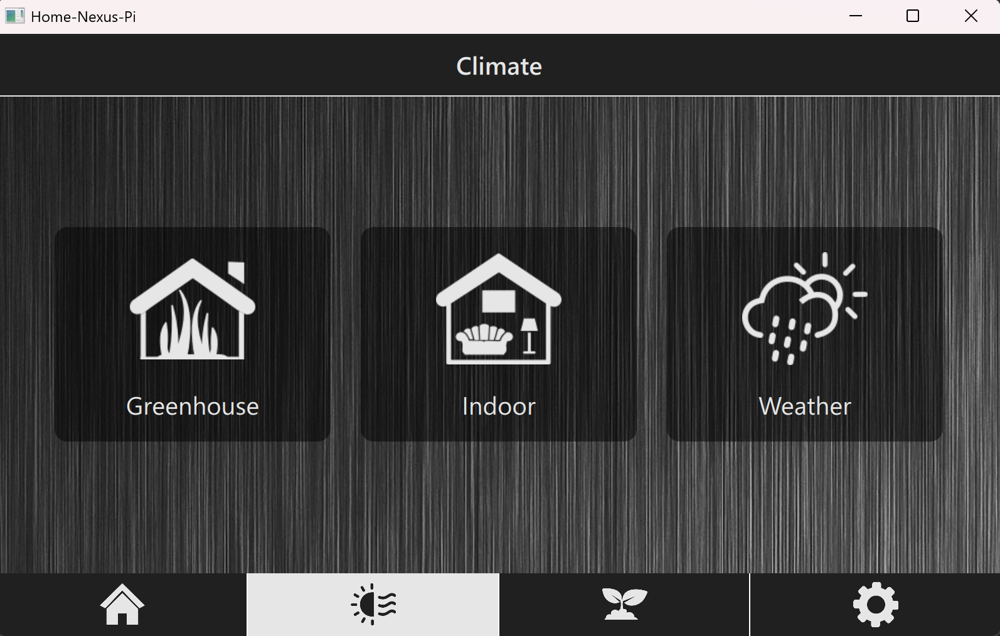
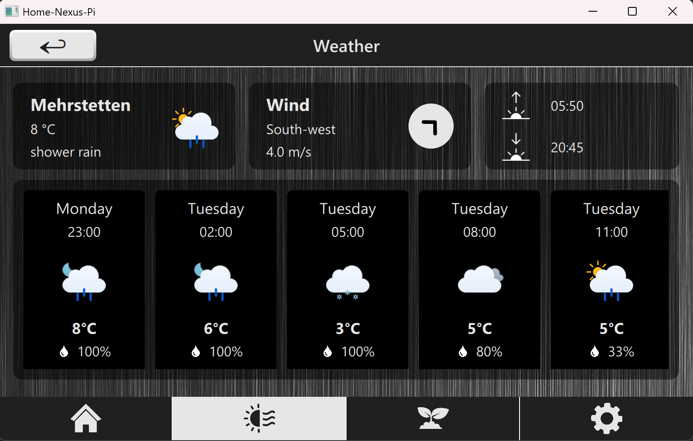
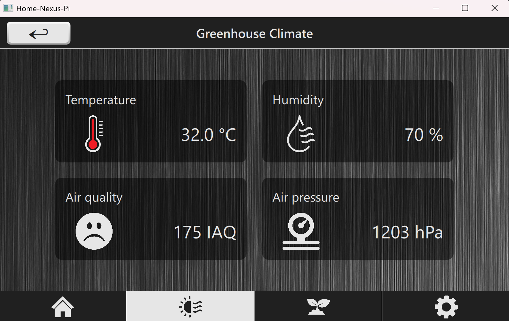

# Home-Nexus-Pi

> **Project status:**  
> This project is currently incomplete and still under active development.  
> Features, architecture, build scripts, and documentation may change as the project evolves.

## Synopsis

**Home-Nexus-Pi** is an embedded smart-home dashboard application designed for a Raspberry Pi with a 7-inch touchscreen.  
The project aims to provide a central interface for displaying weather data, indoor climate data, greenhouse climate data, plant sensor data, and other home-related information in a modern Qt6/QML-based user interface.

The application is intended to run directly on a Raspberry Pi and interact with local sensors, external APIs, MQTT-based sensor nodes, and backend services.

## Motivation

The goal of this project is to build a practical embedded Linux application while learning and applying modern software engineering practices in the areas of:

- Qt6 and QML-based UI development
- Embedded Linux development on Raspberry Pi
- Modular C++ software architecture
- Cross-compilation using Docker and CMake
- Sensor integration
- MQTT-based communication
- Local data storage and visualization

## Functionality

At a high level, Home-Nexus-Pi is planned to provide the following functionality:

- Weather fetched from the OpenWeather API
- Indoor climate
- Conservatory / greenhouse climate
- Plant monitoring

### Weather Dashboard

The application fetches weather data from the OpenWeather API and displays current outdoor weather information as well as forecast data.

Planned weather-related data includes:

- Current temperature
- Weather condition
- Weather icon
- Wind speed
- Wind direction
- 5-day / 3-hour forecast

### Indoor Climate Monitoring

The application is intended to display indoor climate data from Bosch BME680 sensors.

Planned sensor values include:

- Temperature
- Humidity
- Air pressure
- Air quality / IAQ indication

The indoor sensor can be connected directly to the Raspberry Pi, while remote sensor locations can be integrated through MQTT-based sensor nodes.

### Greenhouse / Conservatory Climate Monitoring

The project is designed to support decentralized sensor locations, such as a greenhouse or conservatory.

External microcontroller-based sensor nodes can collect climate data and publish it to the Raspberry Pi via MQTT. The application backend can then process this data and expose it to the QML frontend.

Planned greenhouse-related data includes:

- Temperature
- Humidity
- Air pressure
- Air quality / IAQ indication

### Plant Monitoring

Plant moisture data is planned to be collected from external microcontroller-based sensor nodes connected via MQTT.

The planned communication flow is:

1. A plant sensor node measures soil moisture.
2. The sensor node publishes the data via MQTT.
3. The Raspberry Pi receives the data through a local MQTT broker.
4. The application backend processes the data.
5. The QML frontend displays the current plant status and, later, historical trends.

### Local Data Logging

Historical climate and plant data is planned to be stored locally using SQLite.

This should make it possible to display historical trends and charts directly on the device.

### User Interface

The user interface is built with Qt Quick / QML and is optimized for a 7-inch touchscreen with a resolution of 800 × 480 pixels.

The planned UI structure includes:

- Home dashboard
- Outdoor weather page
- Indoor climate page
- Greenhouse / conservatory climate page
- Plant monitoring page
- Settings page
- Reusable cards and metric components
- Tab-based navigation
- Stack-based drill-down navigation

## Interaction of Components

The project follows a modular architecture where the QML frontend is separated from the C++ backend.

A simplified component interaction looks like this:

## Technology Stack

### Programming Languages
- C++
- QML
- JavaScript
- Bash

### Framework and Libraries
- Qt6
- CMake
- SQLite
- MQTT
- OpenWeather API

### Target Plaform
- Raspberry Pi 4 (ARM64)
- Raspberry Pi OS Trixie (Debian-based Linux)
- 7-inch touchscreen 

### Planned / Optional Components
- Mosquitto MQTT broker
- Bosch BME680 sensor integration
- Raspberry Pi Camera integration
- OpenCV
- WebSocket communication
- REST API communication
